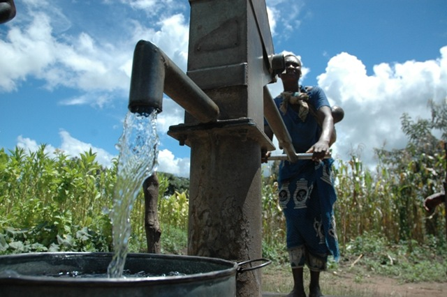
# TANZANIAN WATER WELLS

***
## OVERVIEW
***
Tanzania, the fifth most populous country in Africa, has experienced significant economic growth over the years, however despite considerable investment in water supply infrastructure from donor funding and the government, a significant proportion of its population remains without proper access to improved drinking water. With their Millennium Development Goals (MDGs) to halve the proportion of people that do not have access to water services by 2015, Tanzania only increased its access to improved drinking water from 54 percent to 56 percent [JMP, 2015](https://www.unwater.org/sites/default/files/app/uploads/2020/04/WHOUNICEF-Joint-Monitoring-Program-for-Water-Supply-and-Sanitation-JMP-%e2%80%93-2015-Update_-ENG.pdf). The country now faces a difficult task of meeting the Sustainable Development Goals (SDGs) to provide universal coverage of safe water by 2030.

***
##  BUSINESS UNDERSTANDING
***

One persistent problem that has adversely affected the country’s effort in increasing access to improved water  services  is  the  prevailing  high  levels  of  non-functionality  or  failures  of  its  current  water infrastructures  and  in  particular,  water points and while this issue is prevalent in Africa, evidence indicates that the  problem  of water point failures  may  be relatively more serious in  Tanzania with some estimates putting the figure as high as 44 percent [Banks & Furey, 2016](https://www.researchgate.net/publication/312027512_What's_Working_Where_and_for_How_Long_A_2016_Water_Point_Update).

A holistic approach was used to determine the factors to be considered to be able to predict water point failure. These factors included age of the  water point, technology used, the quantity and quality of the water as well as location and management of these water points. We also considered the population  that use these water points, and the sources of the water. Using a variety of statistical methods, we seek to understand the impact of these factors on water point’s failure and develop a model to predict the possibility of water pump failure with an accuracy above 90%.

***
## PROBLEM STATEMENT
***
> We have been tasked by World Bank Group together with the Government of Tanzania to seek a better understanding as to why water point failure is significantly higher in Tanzania as opposed to the rest of Africa as well as a way to reliably predict when water pumps shall fail as they tackle the difficult tast of meeting their 2030 MDG goals in Environmental Sustainability 
***

## OBJECTIVES
***
**1. Analyze the Impact of Age, Technology, and Investment on Water Point Failure**

**2. Assess the Impact of Socioeconomic and Geographical Factors**

**3. Develop a Predictive Model for Water Point Failure**

***
## DATA UNDERSTANDING
 ***
This research utilized data from [DRIVEN DATA](https://www.drivendata.org/competitions/7/pump-it-up-data-mining-the-water-table/page/23/) about waterpoints. The dataset was split into three CSV files:
- **Training set values**
- **Training set labels**
- **Test set values**

The training and test datasets contained similar columns, while the training set labels dataset included one column, which was the focus of the study.

### Column Information

The following columns were provided in the training and testing datasets:

- **amount_tsh**:Total static head (amount of water available to waterpoint)
- **date_recorded**: The date the row was entered
- **funder**: Who funded the well
- **gps_height**: Altitude of the well
- **installer**: Organization that installed the well
- **longitude**: GPS coordinate
- **latitude**: GPS coordinate
- **wpt_name**: Name of the waterpoint if there is one
- **num_private**: [Missing information]
- **basin**: Geographic water basin
- **subvillage**: Geographic location
- **region**: Geographic location
- **region_code**: Geographic location (coded)
- **district_code**: Geographic location (coded)
- **lga**: Geographic location
- **ward**: Geographic location
- **population**: Population around the well
- **public_meeting**: True/False
- **recorded_by**: Group entering this row of data
- **scheme_management**: Who operates the waterpoint
- **scheme_name**: Who operates the waterpoint
- **permit**: If the waterpoint is permitted
- **construction_year**: Year the waterpoint was constructed
- **extraction_type**: The kind of extraction the waterpoint uses
- **extraction_type_group**: The kind of extraction the waterpoint uses
- **extraction_type_class**: The kind of extraction the waterpoint uses
- **management**: How the waterpoint is managed
- **management_group**: How the waterpoint is managed
- **payment**: What the water costs
- **payment_type**: What the water costs
- **water_quality**: The quality of the water
- **quality_group**: The quality of the water
- **quantity**: The quantity of water
- **quantity_group**: The quantity of water
- **source**: The source of the water
- **source_type**: The source of the water
- **source_class**: The source of the water
- **waterpoint_type**: The kind of waterpoint
- **waterpoint_type_group**: The kind of waterpoint

### Labels Information

The labels in the training set labels contained one column, **status_group**. This column indicates the condition of the waterpoint with the following possible outcomes:

- **functional**: The waterpoint is operational and there are no repairs needed
- **functional needs repair**: The waterpoint is operational, but needs repairs
- **non functional**: The waterpoint is not operational
***
## OBSERVATIONS 
***
### Objective 1: Analyze the Impact of Age, Technology, Geography, and Investment on Water Point Failure
***
1. AGE
***
There has been a great increase in investment in water points over the past 15 years

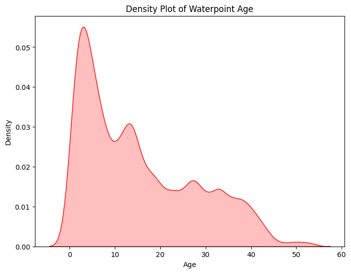

 However we can see that more than a quarter of these points have failed within the first
 
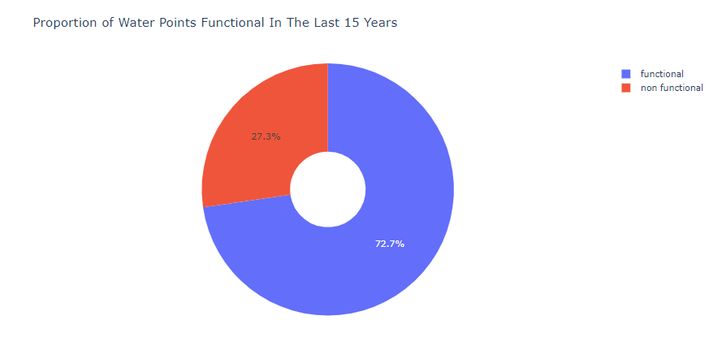

 and in the next 10 years the rate of failure is more significant
 
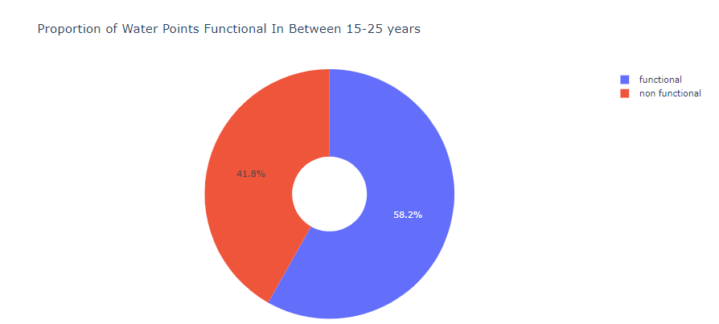

***
2. TECHNOLOGY
***
Over the years emphasis has been placed on using rope pumps and handpumps with very few motor pumps being installed.

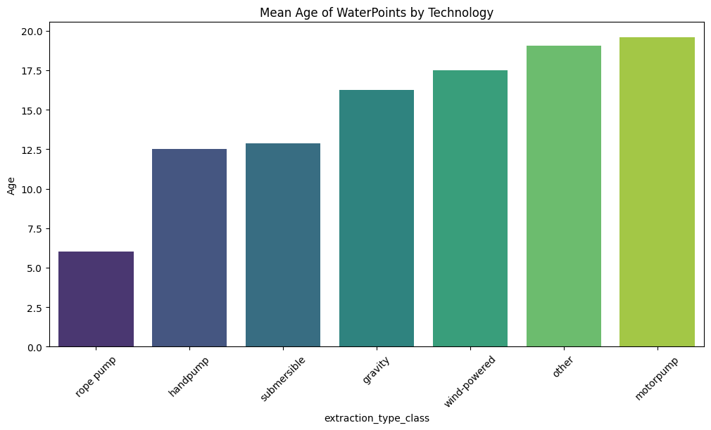

However, we can see that the motor pumps give the best amount of water per water point as per its static head with few being none functional

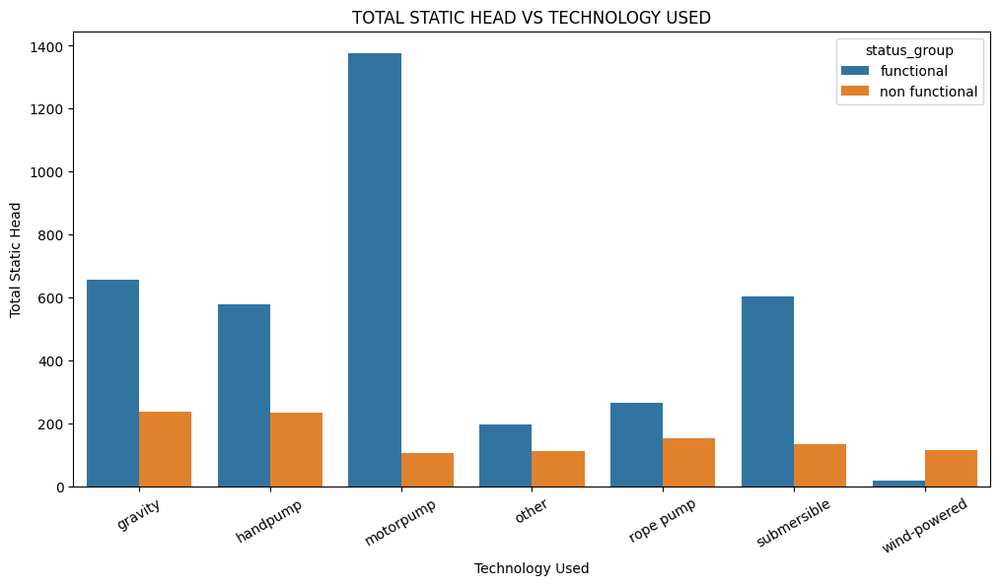

***
3. INVESTMENT
***
There has been heavy investment in rainwater harvesting over the past 7 years with some neglect to the other forms of sources of water. 

With emphasis in Pwani, Shinyanga, Manyara Regions

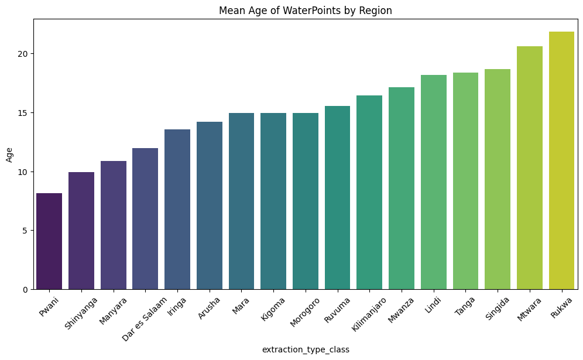

***
### Objective 2: Assess the Impact of Socioeconomic and Geographical Factors
***
1. SOCIOECONOMIC FACTORS
***
 This shows the distribution of population accessing these water points
 
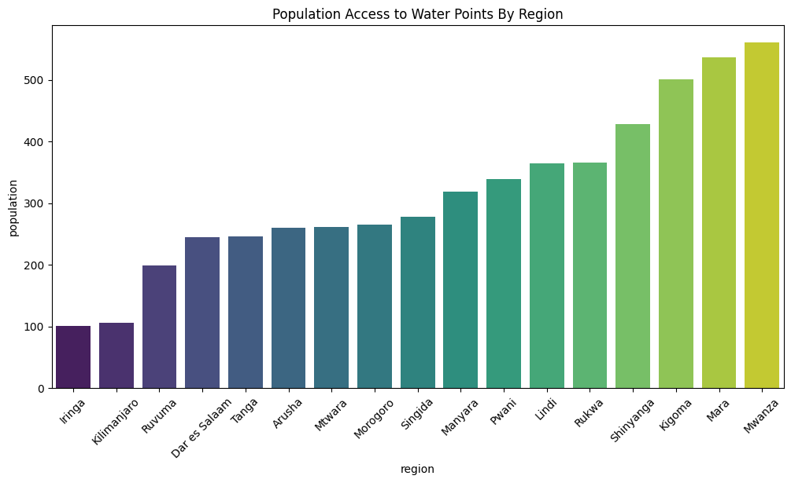

Emphasis should be made in areas such as Mwanza, Mara, Rukwa and Lindi as they are the regions with the most population accessing waterpoints but having more non functional water points

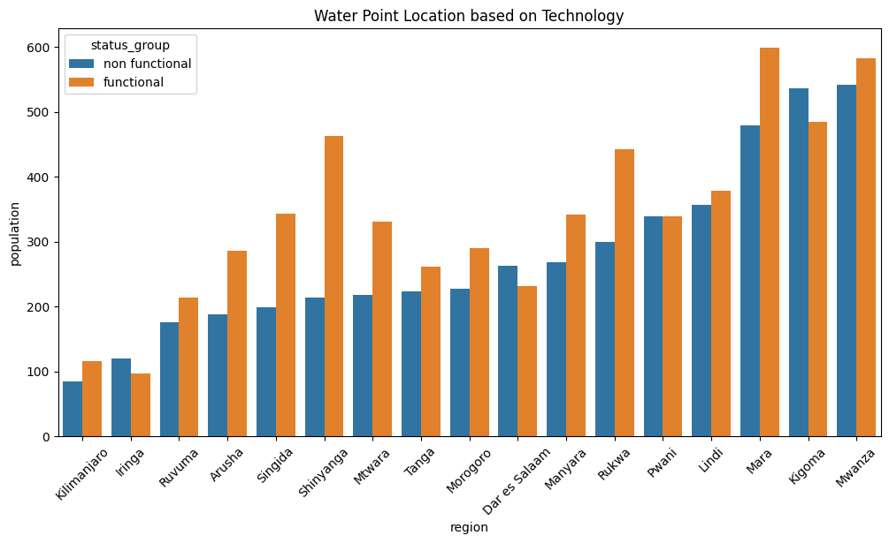

This graph shows that wind powered pumps provide water access to the largest number of population per water point

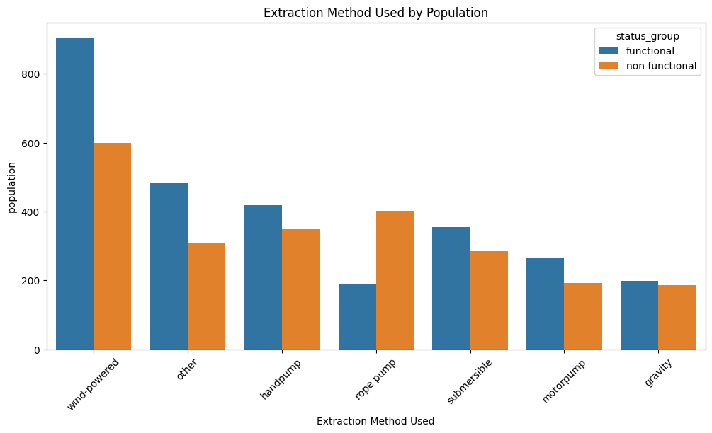

***
2. GEOGRAPHICAL FACTORS
***
Rope pumps and gravity pumps are primarily used in high altitude areas while submersible and motor pumps are used in lower altitude areas

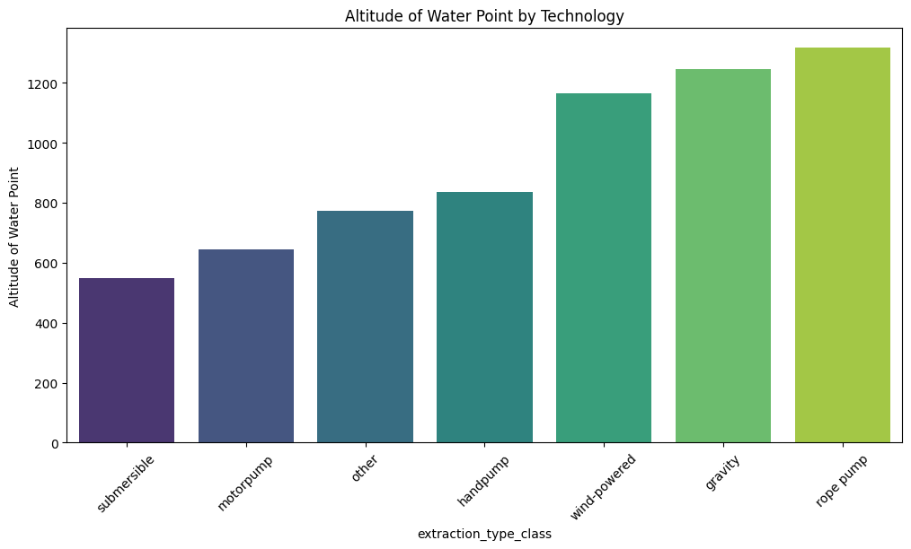

Gravity pumps perform better on average than rope pumps in higher altitude. Motor pumps perform better than submersible pumps but marginally

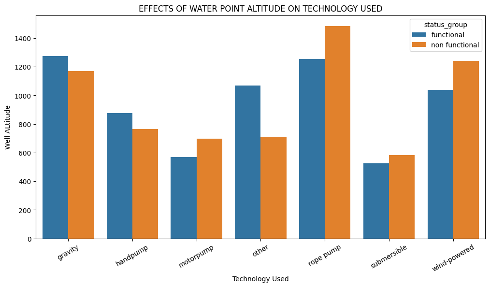

### Objective 3: Develop a Predictive Model for Water Point Failure

For our predictive model. Base Models were attempted on 3 classifiers with their default hyper parameters and the results were as below

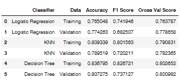

Further analysis was done using 2 classifiers of the ensemble category and results as below 

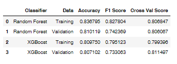

XGBoost model was choosen and hyper parameter tuning was carried out to achieve the project threshold of 80% accuracy

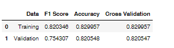

 Distribution Matrix as below
 
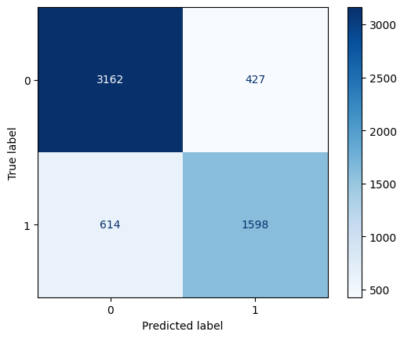

## CONCLUSIONS
***
1. Age of the pumps at the water points are a key indicator for failure with the majority of pumps failing between 10-20 years. 

2. Gravity waterpoints give the best performance compared to other forms of technology with motor pumps on the other hand providing the most water per waterpoint i.e. total static head

3. Heavy investment in the past 7-10 years has been on rain water harvesting and has also been focused on the regions of Pwani, Shinyanga and Manyara.

4. Population main source of water are from dams and water harvesting with dams having few failures

5. Areas of high altitude have more functional water points and mainly use rope pumps but lower altitude areas favor submersible pumps

***
## RECOMMENDATIONS
***
- Water Point Pumps require replacement every 10-15 years to ensure failure doesnt affect the population as well as a premise for predictive maintenance.

- Focus needs to be meet in regions such as Lindi, Mwanza, Mara and Rukwa which have high population accessing fewer water points.

- Leverage more reliable extraction type technology such as motor pumps which give more water output per water point.As well as seek to encorporate green technology for sustainability eg solor powered or wind powered technologies

- Using the predictive algorithm, you can predict with upto 80% accuracy to prevent water point downtimes. 

- New data required as the dataset is missing significant data points and was recorded over 11 years so feature elemts might have changed

***
